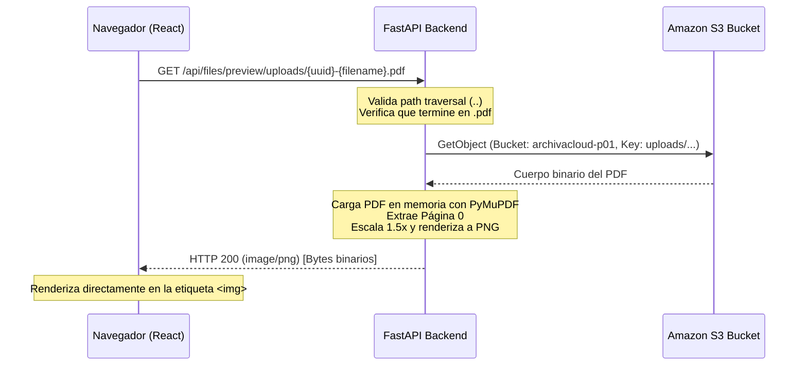

# Documentación de la Feature: Previsualización de PDF (Sprint 4)

Este documento detalla el diseño, arquitectura y flujo de ejecución para la previsualización dinámica de la primera página de archivos PDF en **ArchivaCloud P-01**.

---

## 🛠️ Stack Tecnológico Utilizado
*   **PyMuPDF (fitz)** v1.25.3: Librería de Python de alto rendimiento para interactuar con documentos PDF y renderizar páginas en formatos rasterizados (PNG/JPEG).
*   **FastAPI**: Servidor Web asíncrono para exponer el endpoint de previsualización.
*   **Boto3**: SDK oficial de AWS para descargar los bytes del objeto de forma directa desde Amazon S3.

---

## 🏗️ Flujo Completo de Datos

El flujo de ejecución de extremo a extremo funciona de la siguiente manera:



### 1. Renderizado en Frontend
Cuando la lista de archivos se carga en el frontend:
*   Si el nombre del archivo finaliza en `.pdf`, el componente React inserta una etiqueta de imagen apuntando dinámicamente al endpoint del backend:
    ```html
    
    ```
*   Si finaliza en `.docx`, se renderiza directamente un icono estilizado de Microsoft Word mediante `Lucide React`, ahorrando ancho de banda y procesamiento.

### 2. Validaciones en Backend (`backend/main.py`)
Antes de interactuar con S3, el endpoint `GET /api/files/preview/{key:path}` realiza controles de seguridad rigurosos:
*   **Path Traversal Check**: Rechaza solicitudes que contengan caracteres de navegación de directorios (`..` o `\`).
*   **Prefijo y Formato**: Valida que la clave empiece con `uploads/` y finalice en `.pdf`.

### 3. Descarga Directa a Memoria
El backend descarga el archivo de S3 de forma segura en memoria a través de streams sin escribir archivos temporales en el disco del servidor, reduciendo el riesgo de accesos no autorizados y mejorando el rendimiento:
```python
response = s3_client.get_object(Bucket=S3_BUCKET_NAME, Key=key)
pdf_bytes = response["Body"].read()
```

### 4. Procesamiento con PyMuPDF y Conversión a PNG
El backend carga el stream binario de bytes, procesa el documento y renderiza la primera página (página 0) en formato PNG. Se aplica una matriz de transformación de `1.5x` para asegurar que el texto sea perfectamente legible incluso en resoluciones altas:
```python
doc = fitz.open(stream=pdf_bytes, filetype="pdf")
page = doc.load_page(0)
pix = page.get_pixmap(matrix=fitz.Matrix(1.5, 1.5))
png_bytes = pix.tobytes("png")
doc.close()
```

### 5. Respuesta HTTP al Navegador
La imagen resultante se sirve de forma directa en el cuerpo de la respuesta con el tipo MIME correspondiente:
```python
return Response(content=png_bytes, media_type="image/png")
```

---

## 🛡️ Controles de Robustez y Fallbacks
*   **PDF Vacío**: Si el archivo PDF cargado no tiene páginas (`page_count == 0`), el backend responde con un error controlado `HTTP 400 Bad Request`.
*   **Error de Carga**: Si el objeto fue borrado recientemente o no existe en S3, el backend retorna `HTTP 404 Not Found` en lugar de una traza de pila.
*   **Fallback en Frontend**: En caso de que la imagen falle al cargar (debido a problemas de permisos o red), el frontend cuenta con un manejador `onError` que oculta la imagen rota y despliega el icono por defecto en su lugar:
    ```javascript
    onError={(e) => {
      e.target.style.display = 'none';
      e.target.parentNode.querySelector('.fallback-icon').style.display = 'flex';
    }}
    ```
